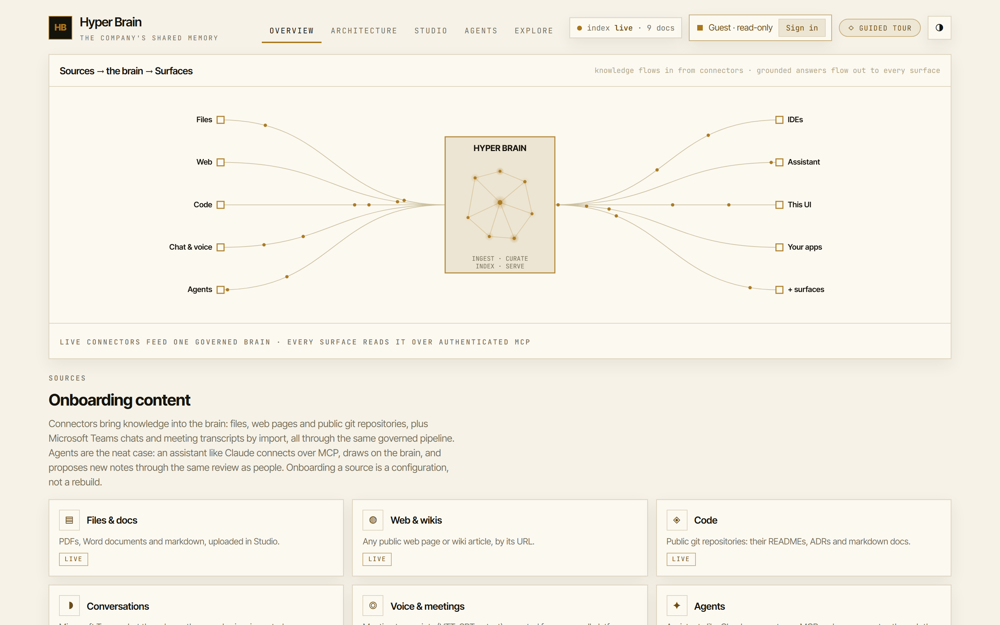
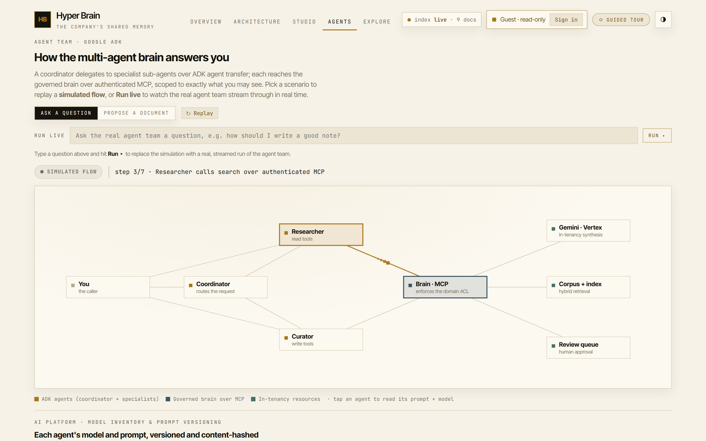
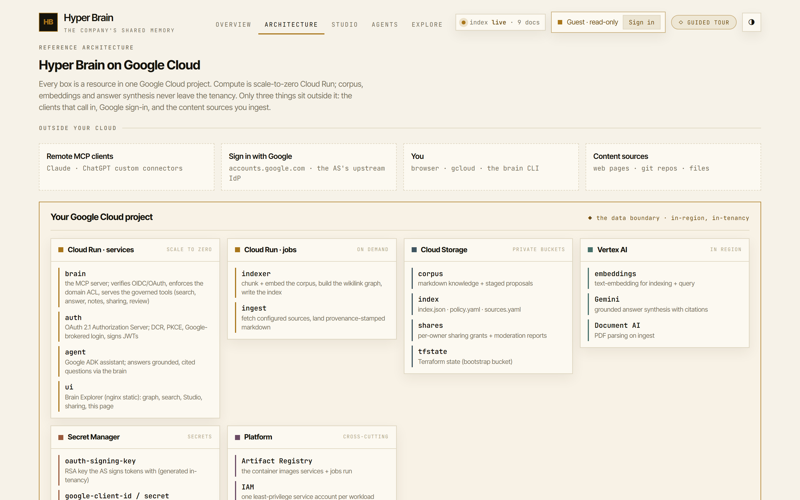

# hyper-brain

**Your company's shared memory.** Hyper Brain is an enterprise-grade,
hyperscaler-native tool for **curating the context** your teams and your AI rely on,
and then making that context useful everywhere work happens. It runs inside your own
Google Cloud tenancy, is near-zero cost when idle, and tears down cleanly.

Most context tools are built for a single operator. Hyper Brain is built for
**teams**: a shared, governed memory where knowledge flows *in* from connectors,
through one source of truth, and back *out* to every surface that needs it. The same
repository serves an effortless personal demo and a cost- and security-controlled
team deployment, with only configuration changing between them.

<video src="https://raw.githubusercontent.com/paul-byford/hyper-brain/main/video/out/hyper-brain-promo.mp4" poster="https://raw.githubusercontent.com/paul-byford/hyper-brain/main/docs/media/promo-poster.png" controls muted playsinline width="100%"></video>

<sub>▶ A product film, under a minute. If the player does not load, [watch it here](video/out/hyper-brain-promo.mp4) — it is built with Remotion; source in [`video/`](video/).</sub>

- **Design rationale:** [`ARCHITECTURE.md`](ARCHITECTURE.md)
- **Intellectual lineage** (Karpathy's LLM wiki, Garry Tan's gbrain, and what we
  keep or replace): [`docs/LINEAGE.md`](docs/LINEAGE.md)
- **Build plan and status:** [`IMPLEMENTATION-PLAN.md`](IMPLEMENTATION-PLAN.md)
- **Tracing walkthrough:** [`docs/observability.md`](docs/observability.md)
- **Remote connectors (OAuth):** [`docs/oauth.md`](docs/oauth.md): add the brain to Claude/ChatGPT by URL

## A look around

**One governed brain.** Knowledge flows *in* from connectors, through a single governed
centre, and back *out* to every surface over the open MCP protocol. One place to secure,
audit and improve.



**Studio drafts the structure, you finalise.** Paste a link or some text and the
in-tenancy Gemini curator returns a clean, well-structured article: a title, sections and
tags, with auto-detected `[[wikilinks]]` woven into the prose *and* a ranked panel of
suggested links to your existing notes. You review and edit; nothing is saved until you
create it.

![Content Studio: an AI-curated draft "Onboarding New Teammates to the Company Brain" with headings and bullets, [[wikilinks]] highlighted in the body, generated tags, and a Suggested links panel scoring related commons notes](docs/media/studio-draft.png)

**A real agent team answers you.** A coordinator delegates to specialist sub-agents over
Google ADK agent transfer; each reaches the governed brain over authenticated MCP, scoped
to exactly what you may see. Replay the simulated flow, or run the live team.



**All in your own tenancy.** Every box is a resource in one Google Cloud project:
scale-to-zero Cloud Run, private Cloud Storage buckets, Vertex AI. Your corpus, embeddings
and answer synthesis never leave the boundary.



## What it does

### One governed brain

Knowledge flows **in** from connectors, through a single governed brain, and back
**out** to every surface. One governed centre means one place to secure, audit and
improve; every surface gets better the moment you add a source, with nothing to
re-integrate.

### Knowledge in: curate, don't just paste

Bring content in from files, web pages, public git repositories, Microsoft Teams
chats and meeting transcripts. The **Studio** turns a raw page, repo or transcript
into a clean, well-structured note: an in-tenancy Gemini curation pass titles and
sections it, tags it, and suggests `[[wikilinks]]` to your existing notes, and a long
document can be split into a set of linked notes. Everything runs the same pipeline
(fetch, parse, curate, land, index), is stamped with its provenance and de-duplicated
by checksum, and team content is reviewed before it merges. Raw content is not
context; the curation is the point.

### Knowledge out: put the context to work

Every surface talks to the same brain over the open **MCP** protocol: a coding
assistant in the IDE, a chat or agent, the web app, or a tool you build. An assistant
like Claude connects by **signing in with Google**: the brain runs an OAuth 2.1
server with dynamic client registration and PKCE, so there is no token to paste. A
multi-agent team, built on Google ADK, answers grounded, cited questions and can
propose new notes, all scoped to exactly what the caller may see. The agent platform
is itself governed: versioned, content-hashed prompts, a model inventory, and offline
evals that assert both answer correctness and the domain-isolation boundary on every
build.

### Governed for teams

Everyone signs in with Google, and every read and write is clamped to the domains
that person may see. You get a private **personal** space to think in, a shared
**commons** everyone can read (open to contribute, with rate-limiting and community
moderation), and **team** domains whose content lands through review. Share a single
note or a whole space with a colleague when you are ready. Clear boundaries are what
make shared curation safe at scale.

### Stored in an open format (OKF)

Everything Hyper Brain knows is written in Google's
[**Open Knowledge Format**](https://github.com/GoogleCloudPlatform/knowledge-catalog/tree/main/okf):
plain markdown + YAML frontmatter under git, where each note is a portable **concept**
with a `type`. Your corpus is a `git clone`-able OKF bundle, so your curated context is
never locked in: export any space as a bundle for another OKF tool or Google's Knowledge
Catalog, and import an OKF bundle from elsewhere through the same pipeline. OKF is the
open standardisation of the Karpathy LLM-wiki pattern this project descends from (see
[`docs/LINEAGE.md`](docs/LINEAGE.md)); Hyper Brain adds the governed serving, isolation,
and review that OKF deliberately leaves open.

## How it works, in one picture

```
  CONNECTORS (in)              ONE GOVERNED BRAIN              SURFACES (out)
  ----------------             ------------------              --------------
  files, web, public git  ==>  Cloud Run, scale-to-zero   ==>  IDEs & assistants (Claude)
  Microsoft Teams chats        hybrid retrieval + Gemini        the Google ADK agent
  meeting transcripts          answers, domain-scoped ACL       the web app, your own apps

  Studio curates each          index + embeddings in your       every surface over MCP,
  source into provenance-      own bucket, in-tenancy Vertex,   each caller signed in
  stamped, [[linked]] markdown loaded on cold start             with Google
```

Knowledge is plain, provenance-stamped markdown with `[[wikilinks]]`, so what the
brain knows is a reviewable, revertible change. There is no database running when
nobody is querying: the index is a file in your own bucket, loaded into a
scale-to-zero container. Embeddings and answer synthesis use first-party Vertex AI
models inside your own tenancy and region, so sensitive content never goes to a third
party. One endpoint, entered by Google sign-in and clamped by policy, safely serves
an IDE, an assistant and the web app at once.

## The two audiences, one codebase

A single switch, `BRAIN_PROFILE` (`personal` or `controlled`), selects one file of
Terraform variables and one policy file. Nothing else branches. The personal demo
exercises the same identity primitive (OIDC plus IAM), the same serving path, the
same agent and UI, and the same isolation logic that a controlled deployment would
use. See [`config/profiles.md`](config/profiles.md) and `ARCHITECTURE.md` section
3.

## Quickstart (the one command)

The `brain` entrypoint provisions and deploys the whole stack to your own Google
Cloud project. To just run and query the brain locally with **no cloud**, skip to
[Getting started](#getting-started).

Prerequisites for the cloud flow: the `gcloud` and `terraform` CLIs, Docker, and a
Google Cloud project with billing enabled. In a controlled environment, project
creation, spend approval and API allow-listing are gated by your organisation; the
command's preflight **detects** these and tells you exactly what to fix rather than
pretending it can do them.

```sh
./brain up             # preflight, provision, deploy, seed the index, print how to connect
./brain ingest         # pull configured sources (files, web, git) into the corpus
./brain grant alice@example.com --domains finserv-ai-engineering
./brain connect        # prints the MCP config block for your agent
./brain review         # list documents proposed into team domains, awaiting review
./brain accept <name>  # accept a proposal into its live domain and reindex
./brain down           # clean teardown
```

On Windows, use the PowerShell entrypoint with the same subcommands, for example
`.\brain.ps1 up -Project my-project`. Re-running `brain up` is idempotent
(Terraform converges, the state bucket bootstrap is create-if-not-exists, the index
upserts by hash). The local subcommands (`index`, `ingest`, `eval`, `agent`,
`connect`, `status`) need no cloud and work today.

New knowledge is added through adapters (`config/sources.yaml`) or by an agent's
gated `propose_document` tool, and always lands as reviewable, provenance-stamped
markdown (see `ARCHITECTURE.md` section 12).

### Reviewing and accepting proposed content

Writes into a **team** domain never go live directly. The `propose_document` MCP
tool stages a provenance-stamped document under `proposals/` in the corpus bucket,
quarantined for review. Promoting one is a deliberate step:

```sh
./brain review            # lists each staged proposal and the live path it would take
./brain accept proposals/finserv-ai-engineering/feature-flags-a1b2c3d4.md
```

`accept` moves the proposal into its live domain folder and reruns the index job, so
it becomes searchable within the index TTL. Both commands are local and drive your
own `gcloud`, so no redeploy is needed. (Personal-space notes written with `add_note`
are owned by the caller, so they skip this queue and land live in the author's
`personal:` domain, appearing after the next index build.)

## What's built

Everything above runs, is validated in CI with no cloud and no cost, and deploys to
Google Cloud with `./brain up`:

- **Curation:** the Studio (URL, git repo, Microsoft Teams export, meeting
  transcript, file, or pasted text), in-tenancy Gemini raw-to-wiki curation with
  auto-tagging and suggested `[[wikilinks]]`, split-into-linked-notes, and edit /
  delete. Batch ingestion adapters (local, web, git) land the same way.
- **Retrieval & answers:** hybrid semantic + keyword + link-graph retrieval with
  reciprocal-rank fusion; grounded, cited Gemini answers with an honest gap
  statement; answer and embedding caching to stay within shared quota.
- **Serving & access:** the MCP server with Google OIDC plus a full OAuth 2.1
  authorization server (dynamic client registration, PKCE, Google-brokered login);
  per-domain ACL enforced server-side; personal / commons / team spaces; note and
  whole-space sharing; rate-limiting and community moderation (report / remove).
- **The agent platform:** the Google ADK multi-agent team over the brain's tools;
  versioned, content-hashed prompts and a model inventory; and offline evals
  (tool-trajectory, ROUGE, and a domain-isolation boundary eval).
- **Infrastructure:** Terraform for both profiles (Cloud Run services + jobs,
  private buckets, least-privilege IAM per workload, Artifact Registry, Vertex,
  Secret Manager, Cloud Trace) with the controlled-only VPC-SC perimeter behind a
  toggle, and checkov + conftest policy-as-code.
- **The web app:** the dependency-free Brain Explorer SPA: the wikilink knowledge
  graph, search and grounded answers, Studio, sharing, review and moderation, and a
  replayable guided tour that onboards a new user to the product.

Design and build detail live in [`ARCHITECTURE.md`](ARCHITECTURE.md) and
[`IMPLEMENTATION-PLAN.md`](IMPLEMENTATION-PLAN.md).

## Getting started

Run and query the brain locally. This uses no cloud and costs nothing.

### Prerequisites

You need two tools. Both are free.

- **Python 3.11 or newer** (developed on 3.13). This runs the application.
  - Windows: `winget install Python.Python.3.13` in PowerShell, or download from
    [python.org](https://www.python.org/downloads/) and tick "Add python.exe to
    PATH" during install.
  - Check it worked: `python --version` should print `Python 3.11` or higher.
- **Git** (to obtain the repository, if you have not already).
  - Windows: `winget install Git.Git`.
  - Check: `git --version`.

That is all for local use. Notes:

- **`make` is not required on Windows.** `make` is a Unix build tool. The
  `Makefile` in this repo is just a shortcut for macOS/Linux users; on Windows use
  the PowerShell commands below, which do exactly the same thing.
- The Google Cloud CLI (`gcloud`) and Terraform are **not** needed to run the core
  locally. They are only for the future `brain up` cloud flow.

### Steps (Windows, PowerShell)

Run these from the repository root (the folder containing this README).

```powershell
# 1. Create an isolated Python environment in .venv
python -m venv .venv

# 2. Allow the activation script to run in this session, then activate the env
Set-ExecutionPolicy -Scope Process -ExecutionPolicy RemoteSigned
.\.venv\Scripts\Activate.ps1

# 3. Install the app and its development tools
pip install -e ".\app[dev]"

# 4. Run the full test suite (functional + security + eval pillars)
python -m pytest app/tests -q

# 5. Build a local search index from the starter corpus
python -m brain_app.indexer.build --corpus corpus --out .brain/index.json
```

After step 2 your prompt shows `(.venv)` and you can run `pytest`, `ruff`, etc.
directly. Run `deactivate` when you want to leave the environment.

> **If you also have Anaconda or Miniconda installed**, your prompt may read
> `(.venv) (base)`. That is normal: `(base)` is conda's default environment,
> which it auto-activates in every shell, and `(.venv)` is this project's
> environment layered on top. The project uses plain `venv` and `pip` (no conda),
> and because `.venv` was activated last it takes precedence, so you are already
> using the right Python. Confirm anytime with
> `python -c "import sys; print(sys.executable)"`; the path should be under
> `.venv\Scripts`. To stop conda adding `(base)` to every prompt, run
> `conda config --set auto_activate_base false` once.

### Add new knowledge (ingestion)

Drop source files under `raw/` (or configure web/git sources in
[`config/sources.yaml`](config/sources.yaml)) and run the ingestion pipeline. It
converts sources to markdown, stamps provenance, and lands them under `corpus/`.
Landing is idempotent, and the corpus diff is your review gate.

```powershell
python -m brain_app.ingest.run --sources config/sources.yaml --corpus corpus
python -m brain_app.indexer.build --corpus corpus --out .brain/index.json   # re-index
```

### Serve the brain over MCP (optional)

To expose the brain to an AI agent or MCP client (Claude Code, Cursor, the ADK
agent), run the MCP server. This needs the `mcp` extra and a token secret; it
still uses no cloud.

```powershell
pip install -e ".\app[mcp]"                 # adds the MCP server + auth deps

# A secret for signing/verifying caller tokens (there is no unauthenticated mode).
$env:BRAIN_AUTH_SECRET = python -c "import secrets; print(secrets.token_urlsafe(32))"
$env:BRAIN_INDEX = ".brain/index.json"
python -m brain_app.serving.server          # serves MCP over http://localhost:8080/mcp
```

The server verifies each caller's bearer token, resolves it to the domains that
identity may see (from [`config/personal.policy.yaml`](config/personal.policy.yaml)),
and filters every result to those domains. A read-only token cannot use the
`propose_document` write tool, and proposals land as a review branch, never a live
write. In production the same server verifies Google-signed OIDC tokens instead
(set `BRAIN_AUTH=google`); see [`.env.example`](.env.example) for all auth
settings. The full list of variables and defaults lives there too.

### Run the demo agent and its evals (optional)

The repository ships a Google ADK agent whose tools are the brain's tools, so you
can prove the whole path, not just the endpoint. It needs the `agent` extra.

```powershell
pip install -e ".\app[agent]"

# Chat with the agent in ADK's dev web UI (offline by default: a deterministic
# model and the brain tools bound in-process, no cloud).
adk web app/brain_app

# Run the free, offline eval tier (tool-trajectory + ROUGE, plus an isolation eval)
python -m pytest app/tests -q -m eval
```

By default the agent runs **offline**: a deterministic fake model with the brain
tools bound in-process, scoped to one domain, so `adk web` and the evals work with
no cloud and no cost. For the real thing, set `BRAIN_AGENT_MODE=live` to run a
**Gemini model on Vertex** with the tools attached over MCP with a bearer token
(needs a running brain server, a token, and Vertex credentials); see
[`.env.example`](.env.example). The eval datasets and thresholds live in
[`app/brain_app/agent/evals/`](app/brain_app/agent/evals/).

### Steps (macOS or Linux, using make)

```sh
make install        # create the virtualenv and install the app with dev tools
make test           # run the full test suite
make index          # build a local index artefact from the starter corpus
```

`make` only wraps the same commands shown above; the Python commands from the
Windows list also work on macOS and Linux (activate with `source
.venv/bin/activate`).

### Configuration (optional)

The core runs with no configuration. Environment variables are optional overrides,
all documented in [`.env.example`](.env.example); the most useful is
`BRAIN_PROFILE` (`personal` by default). To try the controlled profile for one
command in PowerShell:

```powershell
$env:BRAIN_PROFILE = "controlled"; python -m pytest app/tests -q
```

The test suite exercises `search`, `answer` and the domain-isolation boundary, so
a green run means the brain retrieves, synthesises, and keeps domains separated.

## Testing

Testing is a first-class deliverable, organised as three pillars, all run in CI
(`ARCHITECTURE.md` section 10):

1. **Deterministic functional** tests of the retrieval logic.
2. **Security** tests: domain isolation and token verification, plus static
   analysis, dependency audit, secret scanning and infrastructure policy-as-code.
3. **Non-deterministic AI evals**: agent trajectory and answer quality, including
   an isolation eval, with a free offline tier and a richer paid tier for the
   controlled profile.

## Licence

Apache-2.0. See [`LICENSE`](LICENSE). Retrieval design adapted from the
MIT-licensed [gbrain](https://github.com/garrytan/gbrain); see `docs/LINEAGE.md`
for attribution.
