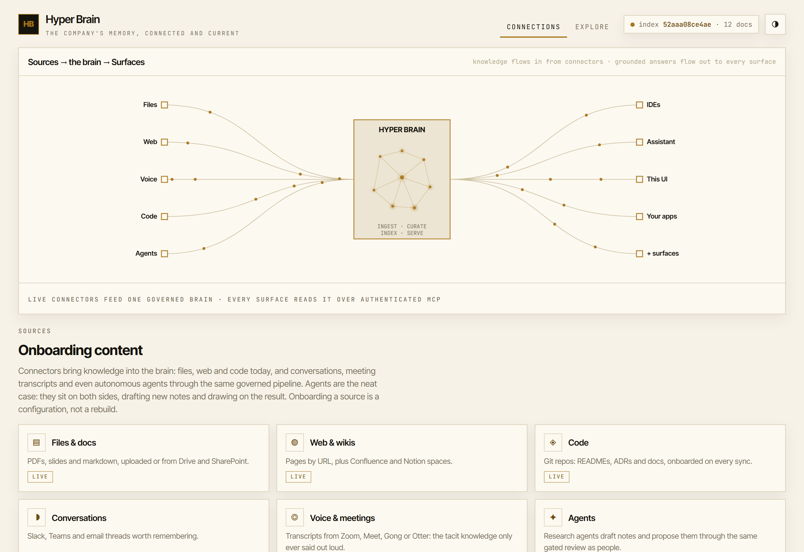

# hyper-brain

A one-command **company brain**: a searchable, versioned knowledge base that your
AI coding agents can query, with multiple knowledge domains isolated from each
other and a data boundary that stays inside your own cloud tenancy.

One person runs a single command and gets a working brain on Google Cloud;
teammates join cheaply. It is near-zero cost when idle and tears down cleanly. The
same repository serves an effortless personal demo and a project that could be deployed inside a cost- and security-controlled environment, with only configuration changing between the two.



- **Design rationale:** [`ARCHITECTURE.md`](ARCHITECTURE.md)
- **Intellectual lineage** (Karpathy's LLM wiki, Garry Tan's gbrain, and what we
  keep or replace): [`docs/LINEAGE.md`](docs/LINEAGE.md)
- **Build plan and status:** [`IMPLEMENTATION-PLAN.md`](IMPLEMENTATION-PLAN.md)
- **Tracing walkthrough:** [`docs/observability.md`](docs/observability.md)
- **Remote connectors (OAuth):** [`docs/oauth.md`](docs/oauth.md) — add the brain to Claude/ChatGPT by URL

## How it works, in one picture

```
corpus (markdown + [[wikilinks]], under git)
        |  index job: chunk, embed (Vertex AI, in-tenancy), build artefact
        v
index artefact per domain in Google Cloud Storage
        ^  loaded in memory on cold start
        |
Brain service (Cloud Run, scale-to-zero)  --- MCP over HTTP --->  agents
  retrieval: semantic + keyword + link graph, fused
  auth: Cloud Run IAM at the edge + verified OIDC + per-domain ACL in-app
        ^
        |  consumed by
Google ADK agent (Gemini on Vertex)  +  Brain Explorer web UI
```

Knowledge is plain markdown in this repo, so changing what the brain knows is a
reviewable, revertible pull request. There is no database running when nobody is
querying: the index is a file in your own bucket, loaded into a scale-to-zero
container. Embeddings and answer synthesis use first-party Vertex AI models inside
your own tenancy and region, so sensitive content never goes to a third party.

## The two audiences, one codebase

A single switch, `BRAIN_PROFILE` (`personal` or `controlled`), selects one file of
Terraform variables and one policy file. Nothing else branches. The personal demo
exercises the same identity primitive (OIDC plus IAM), the same serving path, the
same agent and UI, and the same isolation logic that a controlled deployment would
use. See [`config/profiles.md`](config/profiles.md) and `ARCHITECTURE.md` section
3.

## Quickstart (the one command)

The `brain` entrypoint provisions and deploys the whole stack to your own Google
Cloud project. To just run and query the brain locally with **no cloud**, skip to
[Getting started](#getting-started).

Prerequisites for the cloud flow: the `gcloud` and `terraform` CLIs, Docker, and a
Google Cloud project with billing enabled. In a controlled environment, project
creation, spend approval and API allow-listing are gated by your organisation; the
command's preflight **detects** these and tells you exactly what to fix rather than
pretending it can do them.

```sh
./brain up             # preflight, provision, deploy, seed the index, print how to connect
./brain ingest         # pull configured sources (files, web, git) into the corpus
./brain grant alice@example.com --domains finserv-ai-engineering
./brain connect        # prints the MCP config block for your agent
./brain review         # list documents proposed into team domains, awaiting review
./brain accept <name>  # accept a proposal into its live domain and reindex
./brain down           # clean teardown
```

On Windows, use the PowerShell entrypoint with the same subcommands, for example
`.\brain.ps1 up -Project my-project`. Re-running `brain up` is idempotent
(Terraform converges, the state bucket bootstrap is create-if-not-exists, the index
upserts by hash). The local subcommands (`index`, `ingest`, `eval`, `agent`,
`connect`, `status`) need no cloud and work today.

New knowledge is added through adapters (`config/sources.yaml`) or by an agent's
gated `propose_document` tool, and always lands as reviewable, provenance-stamped
markdown (see `ARCHITECTURE.md` section 12).

### Reviewing and accepting proposed content

Writes into a **team** domain never go live directly. The `propose_document` MCP
tool stages a provenance-stamped document under `proposals/` in the corpus bucket,
quarantined for review. Promoting one is a deliberate step:

```sh
./brain review            # lists each staged proposal and the live path it would take
./brain accept proposals/finserv-ai-engineering/feature-flags-a1b2c3d4.md
```

`accept` moves the proposal into its live domain folder and reruns the index job, so
it becomes searchable within the index TTL. Both commands are local and drive your
own `gcloud`, so no redeploy is needed. (Personal-space notes written with `add_note`
are owned by the caller, so they skip this queue and land live in the author's
`personal:` domain, appearing after the next index build.)

## Project status

This repository is being built in the phases described in
[`IMPLEMENTATION-PLAN.md`](IMPLEMENTATION-PLAN.md). Progress:

- **Implemented:** the offline retrieval core (chunking, `[[wikilink]]` graph,
  hybrid semantic + keyword + link retrieval with reciprocal-rank fusion, `search`
  and `answer` modes, per-domain isolation); the adapter-based ingestion pipeline
  (local, web and git adapters, markdown/HTML parsers, provenance stamping,
  idempotent landing); the MCP serving layer with OIDC-style token auth,
  server-side domain-ACL enforcement, and the gated `propose_document` write path
  that lands proposals as a reviewable branch; the Google ADK demo agent with its
  free, offline eval tier (tool-trajectory and ROUGE metrics, plus an isolation
  eval); the Terraform for both profiles (Cloud Run, buckets, IAM, Artifact
  Registry, Vertex enablement, and the controlled-only VPC-SC perimeter and
  Workforce Identity behind toggles) with checkov + conftest policy-as-code; the
  two starter corpora and the full test suite; the one-command `brain` /
  `brain.ps1` entrypoint (preflight, provision, deploy, seed, connect) with its
  local subcommands; and the Brain Explorer UI (a dependency-free SPA: wikilink
  graph coloured by domain, domain browser, search/answer, and a live
  identity/isolation panel). All of it runs, and is validated in CI, with no cloud
  and no cost.
- **Remaining:** observability wiring, richer corpus, and the end-to-end
  verification rehearsal (phases 8-9).

The `brain up` experience above is the target; today you can build and query the
brain locally (see below).

## Getting started

Run and query the brain locally. This uses no cloud and costs nothing.

### Prerequisites

You need two tools. Both are free.

- **Python 3.11 or newer** (developed on 3.13). This runs the application.
  - Windows: `winget install Python.Python.3.13` in PowerShell, or download from
    [python.org](https://www.python.org/downloads/) and tick "Add python.exe to
    PATH" during install.
  - Check it worked: `python --version` should print `Python 3.11` or higher.
- **Git** (to obtain the repository, if you have not already).
  - Windows: `winget install Git.Git`.
  - Check: `git --version`.

That is all for local use. Notes:

- **`make` is not required on Windows.** `make` is a Unix build tool. The
  `Makefile` in this repo is just a shortcut for macOS/Linux users; on Windows use
  the PowerShell commands below, which do exactly the same thing.
- The Google Cloud CLI (`gcloud`) and Terraform are **not** needed to run the core
  locally. They are only for the future `brain up` cloud flow.

### Steps (Windows, PowerShell)

Run these from the repository root (the folder containing this README).

```powershell
# 1. Create an isolated Python environment in .venv
python -m venv .venv

# 2. Allow the activation script to run in this session, then activate the env
Set-ExecutionPolicy -Scope Process -ExecutionPolicy RemoteSigned
.\.venv\Scripts\Activate.ps1

# 3. Install the app and its development tools
pip install -e ".\app[dev]"

# 4. Run the full test suite (functional + security + eval pillars)
python -m pytest app/tests -q

# 5. Build a local search index from the starter corpus
python -m brain_app.indexer.build --corpus corpus --out .brain/index.json
```

After step 2 your prompt shows `(.venv)` and you can run `pytest`, `ruff`, etc.
directly. Run `deactivate` when you want to leave the environment.

> **If you also have Anaconda or Miniconda installed**, your prompt may read
> `(.venv) (base)`. That is normal: `(base)` is conda's default environment,
> which it auto-activates in every shell, and `(.venv)` is this project's
> environment layered on top. The project uses plain `venv` and `pip` (no conda),
> and because `.venv` was activated last it takes precedence, so you are already
> using the right Python. Confirm anytime with
> `python -c "import sys; print(sys.executable)"`; the path should be under
> `.venv\Scripts`. To stop conda adding `(base)` to every prompt, run
> `conda config --set auto_activate_base false` once.

### Add new knowledge (ingestion)

Drop source files under `raw/` (or configure web/git sources in
[`config/sources.yaml`](config/sources.yaml)) and run the ingestion pipeline. It
converts sources to markdown, stamps provenance, and lands them under `corpus/`.
Landing is idempotent, and the corpus diff is your review gate.

```powershell
python -m brain_app.ingest.run --sources config/sources.yaml --corpus corpus
python -m brain_app.indexer.build --corpus corpus --out .brain/index.json   # re-index
```

### Serve the brain over MCP (optional)

To expose the brain to an AI agent or MCP client (Claude Code, Cursor, the ADK
agent), run the MCP server. This needs the `mcp` extra and a token secret; it
still uses no cloud.

```powershell
pip install -e ".\app[mcp]"                 # adds the MCP server + auth deps

# A secret for signing/verifying caller tokens (there is no unauthenticated mode).
$env:BRAIN_AUTH_SECRET = python -c "import secrets; print(secrets.token_urlsafe(32))"
$env:BRAIN_INDEX = ".brain/index.json"
python -m brain_app.serving.server          # serves MCP over http://localhost:8080/mcp
```

The server verifies each caller's bearer token, resolves it to the domains that
identity may see (from [`config/personal.policy.yaml`](config/personal.policy.yaml)),
and filters every result to those domains. A read-only token cannot use the
`propose_document` write tool, and proposals land as a review branch, never a live
write. In production the same server verifies Google-signed OIDC tokens instead
(set `BRAIN_AUTH=google`); see [`.env.example`](.env.example) for all auth
settings. The full list of variables and defaults lives there too.

### Run the demo agent and its evals (optional)

The repository ships a Google ADK agent whose tools are the brain's tools, so you
can prove the whole path, not just the endpoint. It needs the `agent` extra.

```powershell
pip install -e ".\app[agent]"

# Chat with the agent in ADK's dev web UI (offline by default: a deterministic
# model and the brain tools bound in-process, no cloud).
adk web app/brain_app

# Run the free, offline eval tier (tool-trajectory + ROUGE, plus an isolation eval)
python -m pytest app/tests -q -m eval
```

By default the agent runs **offline**: a deterministic fake model with the brain
tools bound in-process, scoped to one domain, so `adk web` and the evals work with
no cloud and no cost. For the real thing, set `BRAIN_AGENT_MODE=live` to run a
**Gemini model on Vertex** with the tools attached over MCP with a bearer token
(needs a running brain server, a token, and Vertex credentials); see
[`.env.example`](.env.example). The eval datasets and thresholds live in
[`app/brain_app/agent/evals/`](app/brain_app/agent/evals/).

### Steps (macOS or Linux, using make)

```sh
make install        # create the virtualenv and install the app with dev tools
make test           # run the full test suite
make index          # build a local index artefact from the starter corpus
```

`make` only wraps the same commands shown above; the Python commands from the
Windows list also work on macOS and Linux (activate with `source
.venv/bin/activate`).

### Configuration (optional)

The core runs with no configuration. Environment variables are optional overrides,
all documented in [`.env.example`](.env.example); the most useful is
`BRAIN_PROFILE` (`personal` by default). To try the controlled profile for one
command in PowerShell:

```powershell
$env:BRAIN_PROFILE = "controlled"; python -m pytest app/tests -q
```

The test suite exercises `search`, `answer` and the domain-isolation boundary, so
a green run means the brain retrieves, synthesises, and keeps domains separated.

## Testing

Testing is a first-class deliverable, organised as three pillars, all run in CI
(`ARCHITECTURE.md` section 10):

1. **Deterministic functional** tests of the retrieval logic.
2. **Security** tests: domain isolation and token verification, plus static
   analysis, dependency audit, secret scanning and infrastructure policy-as-code.
3. **Non-deterministic AI evals**: agent trajectory and answer quality, including
   an isolation eval, with a free offline tier and a richer paid tier for the
   controlled profile.

## Licence

Apache-2.0. See [`LICENSE`](LICENSE). Retrieval design adapted from the
MIT-licensed [gbrain](https://github.com/garrytan/gbrain); see `docs/LINEAGE.md`
for attribution.
